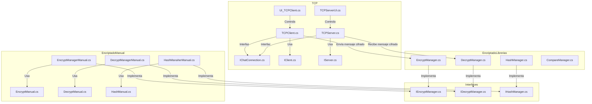

# Resolución de los puntos del laboratorio

Este proyecto resuelve los puntos 2.1 y 2.2 del laboratorio de la siguiente manera:

- **2.1. Uso de librerías:** Se investigaron y utilizaron librerías estándar de C# para hashing (como SHA256) y cifrado con llave privada (por ejemplo, RSA). El sistema permite escribir un mensaje, hashearlo, cifrarlo y enviarlo mediante TCP, junto con la llave pública, para que el receptor pueda verificar la autenticidad e integridad del mensaje recibido. Toda la lógica criptográfica basada en librerías está implementada en la carpeta `EncriptadoLibrerias/` y se integra al flujo general mediante interfaces y el patrón adaptador, facilitando su reemplazo o extensión.

- **2.2. Desarrollo de algoritmos propios:** Además de las librerías estándar, se diseñaron algoritmos propios para hashing (determinista e irreversible) y cifrado con llave privada (reversible al compartir la llave pública). Por ejemplo, el cifrado propio puede multiplicar los valores ASCII del mensaje y la clave, permitiendo la recuperación del mensaje original al dividir y convertir de vuelta a texto. Estos algoritmos están implementados en la carpeta `EncriptadoManual/` y se integran al flujo existente usando las mismas interfaces, permitiendo alternar entre la lógica estándar y la personalizada para pruebas y comparación.

De este modo, el proyecto cumple con los requisitos del laboratorio, permitiendo comparar y validar tanto la funcionalidad como la robustez de ambas aproximaciones.

# Documentación del Proyecto: Sistema de Firma Digital en Unity

## Descripción General

Este proyecto implementa un sistema de firma digital en Unity 3D. Permite que un usuario escriba un mensaje, lo hashee, lo cifre con una clave privada y lo envíe mediante TCP o UDP junto con la clave pública. El receptor puede verificar la autenticidad e integridad del mensaje recibido. El sistema utiliza tanto librerías estándar de C# para hashing y criptografía como algoritmos propios, integrados mediante el patrón adaptador para facilitar su reemplazo y extensión.

---

## Estructura de Carpetas y Scripts

**Assets/PrimeraParte/Scripts/**
Carpeta principal donde se encuentran los scripts del proyecto, organizados en las siguientes subcarpetas:

- **CHatTcp/**
	- `TCPClient.cs`, `TCPServer.cs`: Implementación de cliente y servidor TCP para el envío y recepción de mensajes.
	- **Interface/**: Interfaces para la conexión y lógica de cliente/servidor de chat (`IChatConnection.cs`, `IClient.cs`, `IServer.cs`).
	- **UI/**: Interfaces de usuario para el cliente y servidor TCP (`TCPServerUI.cs`, `UI_TCPClient.cs`).

- **EncriptadoLibrerias/**
	- `EncryptManager.cs`, `DecryptManager.cs`, `HashManager.cs`, `CompareManager.cs`: Lógica de cifrado, descifrado, hashing y comparación usando librerías estándar de C#.

- **EncriptadoManual/**
	- **Encrypt/**: `EncryptManagerManual.cs`, `EncryptManual.cs`: Implementación de cifrado propio/manual.
	- **Decrypt/**: `DecryptManagerManual.cs`, `DecryptManual.cs`: Implementación de descifrado propio/manual.
	- **Hash/**: `HashManaherManual.cs`, `HashManual.cs`: Implementación de hashing propio/manual.

- **interfaces/**
	- `IEncryptManager.cs`, `IDecryptManager.cs`, `IHashManager.cs`: Interfaces para los managers de cifrado, descifrado y hashing.

---

---

## Diagrama de Flujo de Scripts

---

## Explicación del Flujo

1. **Comunicación TCP**:  
	- `TCPClient.cs` y `TCPServer.cs` gestionan el envío y recepción de mensajes entre cliente y servidor.
	- Las interfaces (`IChatConnection.cs`, `IClient.cs`, `IServer.cs`) definen los contratos para la comunicación.
	- Las UIs (`TCPServerUI.cs`, `UI_TCPClient.cs`) permiten la interacción de usuario con el sistema de red.

2. **Cifrado y Descifrado con Librerías**:  
	- `EncryptManager.cs` y `DecryptManager.cs` usan algoritmos estándar de C# para cifrar y descifrar mensajes.
	- `HashManager.cs` permite hashear mensajes y `CompareManager.cs` comparar resultados.

3. **Cifrado y Descifrado Manual**:  
	- `EncryptManagerManual.cs`, `EncryptManual.cs`, `DecryptManagerManual.cs`, `DecryptManual.cs` implementan algoritmos propios para cifrado y descifrado.
	- `HashManaherManual.cs`, `HashManual.cs` implementan hashing propio.

4. **Interfaces de Abstracción**:  
	- Las interfaces en la carpeta `interfaces/` (`IEncryptManager.cs`, `IDecryptManager.cs`, `IHashManager.cs`) permiten intercambiar fácilmente entre la lógica basada en librerías y la manual.

5. **Flujo General**:  
	- El cliente escribe un mensaje, lo hashea y cifra (usando la implementación seleccionada), y lo envía al servidor.
	- El servidor recibe el mensaje, lo descifra y verifica la integridad usando el hash.
	- Todo el flujo puede alternar entre algoritmos estándar y propios gracias a la arquitectura basada en interfaces.

---

## Notas sobre la Implementación Criptográfica

- **Hashing**: Se utiliza una función determinista e irreversible, ya sea de una librería estándar (como SHA256) o un algoritmo propio.
- **Cifrado con Clave Privada**: Se implementa un algoritmo propio donde el mensaje y la clave se combinan (por ejemplo, multiplicando sus valores ASCII), permitiendo la recuperación del mensaje original con la clave pública.
- **Patrón Adaptador**: Permite intercambiar fácilmente entre la implementación estándar y la personalizada.

---
# EncriptacionBaseServicios

